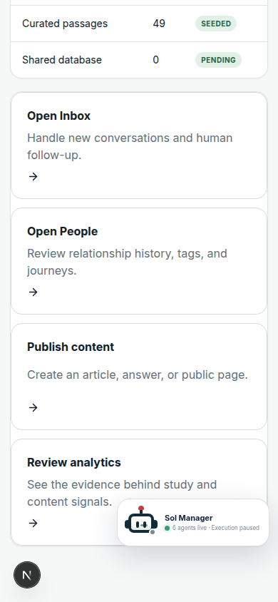
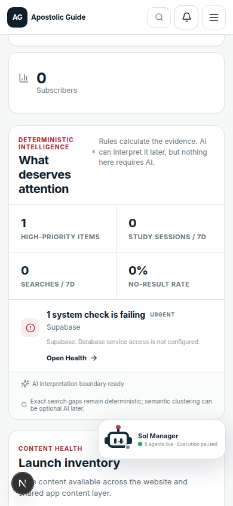
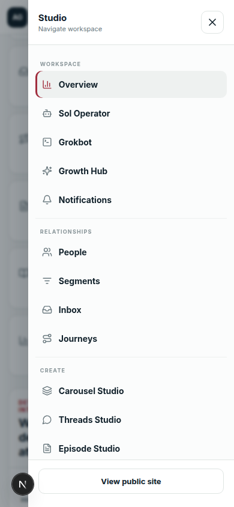
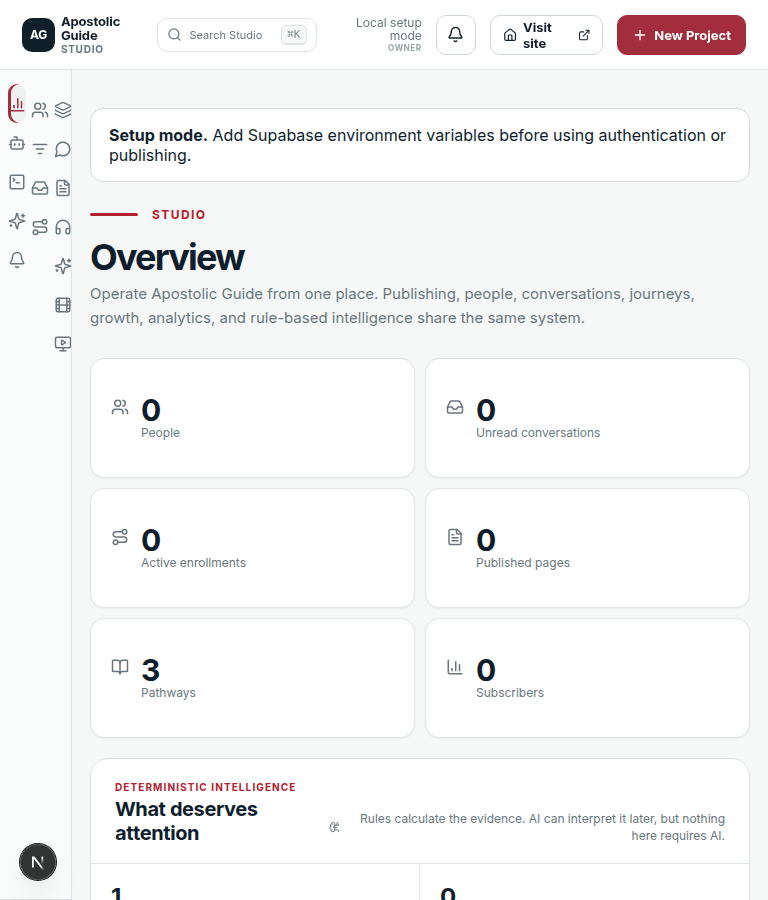
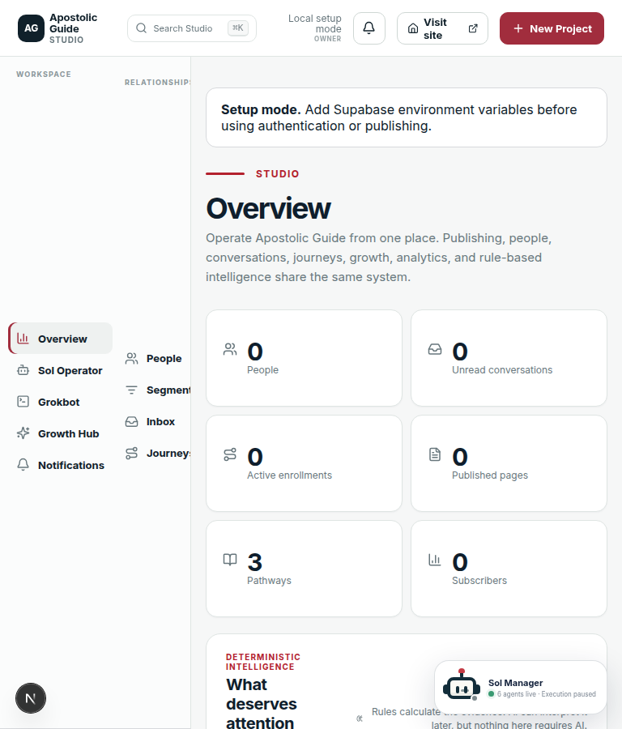
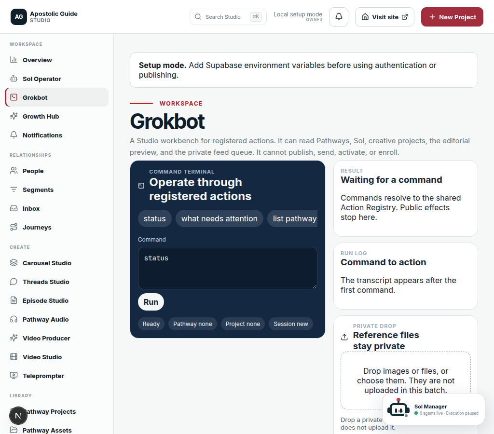

# Release readiness — 2026-10-08 initial QA

This is the **initial discovery and visual polish pass** for Issue #120. It is **not** final release-candidate validation, and it does **not** authorize merging PR #115 into `main`.

A later recheck is required after Issue #119 is reviewed and integrated, or after an explicit owner decision to leave it out of this release.

## Branch and pending work

| Item | Value |
| --- | --- |
| Audited base | `integration/ag-unified-20261006` at `3e203798167d9d6535c545c16696f4042bd5b893` (PR #118 merge) |
| This branch | `qa/ag-visual-route-release-audit-20261008` |
| PR target | `integration/ag-unified-20261006` only |
| Unified release PR | #115, still **draft**, targets `main`. Do not merge from this pass. |
| Issue #119 | Open. No merged implementation on this branch. Grokbot session, upload, and plan implementation files were not edited. |
| Missing Sol commits | `04359be`, `7711357`, and `e72ab1c` are **not** in this repository. Not recovered and not deferred by the owner. |

No production migration, cron change, social send, email send, or production deploy was performed.

## Release blocker ledger

| # | Blocker | Status |
| --- | --- | --- |
| 1 | Issue #119 integrated, or an explicit documented deferral | **OPEN.** Issue is open. This audit does not include its durable sessions, uploads, or Planning Desk. |
| 2 | Local Sol commits `04359be`, `7711357`, `e72ab1c` recovered or explicitly deferred | **OPEN.** Objects are absent from git history here. |
| 3 | Authenticated Studio and Grokbot positive-path E2E, role boundaries, and private uploads on staging | **BLOCKED.** No Supabase staging URL, keys, or test identities were available. Local Studio rendered only in unconfigured setup mode. That is not an authenticated pass. |
| 4 | SQL migration dry-run on a non-production database, or a documented release cut that excludes untested schema | **BLOCKED.** Migrations were read. They were not applied to any database. |
| 5 | No critical or high reproducible overlap, overflow, data-loss, auth, or external-effect defects | **PARTIAL.** The high Studio overlap/sticky defect below is fixed on this branch and rechecked in Chrome. Authenticated data-loss and external-effect paths were not exercised. |
| 6 | Final CI and Vercel preview clean at the exact RC SHA | **NOT RUN.** There is no release-candidate SHA yet. Preview for this QA branch starts only after this branch is pushed. |
| 7 | Explicit owner authorization before any production migration and before merging #115 | **OPEN.** Not requested and not granted. |

**Release decision: not ready.** Do not merge #115.

## What was exercised

Environment: local `next dev` on this branch, Chrome, no `NEXT_PUBLIC_SUPABASE_*` credentials. Viewports **390, 768, 1024, and 1440**. Public pages use the seeded catalog. Studio pages that allow unconfigured mode show “Setup mode” and empty operational data. Pages that require `access.state === "allowed"` send the browser to `/admin`.

`https://www.apostolicguide.com/` and `https://app.apostolicguide.com/` both returned HTTP 200 on a read-only HEAD. That checks the live handoff hosts only. It is not a test of this branch’s preview.

## Route matrix

Permission notes: public routes have no Studio role. Studio permissions come from `src/studio-nav.tsx`. In this environment, “renders in setup mode” means the shell loaded without a signed-in user. “Redirects until allowed” means a real browser landed on `/admin` Overview because the page requires an authenticated allowed session.

### Public site

| Route | Nav | Data | Empty / failure | Mobile | Evidence |
| --- | --- | --- | --- | --- | --- |
| `/` | Header brand | Seeded Scripture, answers, topics, articles, pathways | Catalog is in-repo, so the homepage is not empty | Header hides desktop links at 980px and uses the menu | 200 at all four widths. Screenshots `home-390.png`, `home-1024.png` |
| `/topics`, `/topics/jesus-is-god` | Header Topics | Seeded topics | Unknown slug calls `notFound()` | Filter pills scroll inside the rail | 200. Detail stays on the topic URL |
| `/scripture`, `/scripture/john/1/1` | Header Scripture | Seeded passages | Unknown path is a not-found | Filter buttons scroll inside the rail | 200 |
| `/pathways`, `/pathways/jesus-is-god` | Header Pathways | `pathway-catalog` | Unknown slug is a not-found | Category chips scroll inside the rail; study layout stacks under 980px | 200. Screenshot `pathway-jesus-is-god-390.png` |
| `/articles`, `/articles/the-one-god-revealed-in-jesus-christ` | Header Articles | Seeded articles | Unknown slug is a not-found | Reading layout becomes one column under 980px | 200, no page-level horizontal scroll |
| `/answers`, `/answers/is-jesus-god` | Footer and mobile menu | Seeded answers | Unknown slug is a not-found | Single column under 650px | 200 |
| `/media` | Header Media | Seeded media cards | Static catalog | Cards stack under 650px | 200 |
| `/about` | Header About | Static | Jump links scroll inside `.about-v2-jump` | Contained chip scroller at 390 | 200 |
| `/search?q=Why%20did%20Jesus%20pray` | Header search icon | Seeded search | Empty query still renders the form | 200 | 200 |
| `/beliefs`, `/how-it-works`, `/subscribe`, `/contact`, `/links`, `/privacy`, `/terms` | Footer and mobile menu | Static | Contact keeps an off-screen honeypot field | 200 | 200 |
| `/install-app` | Header “Open App”, footer app links via `buildAppUrl` | Destination query | Install guide | 200 | 200 |
| `/login`, `/forgot-password`, `/update-password` | Direct | Supabase auth, unconfigured here | Login form renders | Screenshot `login-390.png` | 200 |
| `/app` | Legacy handoff | `next.config.ts` temporary redirect | Destination is the PWA origin, not a path inside this repo | 307 to `https://app.apostolicguide.com/` | Read-only. PWA repo was not modified |
| `/index` | Legacy | Permanent redirect to `/` | — | — | Configured in `next.config.ts` |

Desktop header links: Topics, Scripture, Pathways, Articles, Media, About. Mobile menu adds Common Questions, What We Believe, How Apostolic Guide Works, Stay Connected, and Try the App. Footer adds Admin, Privacy, Terms, Contact, and All links. Sampled public pages kept `documentElement.scrollWidth === clientWidth` at 390, 768, 1024, and 1440. Chip rails that extend past the viewport are inside `overflow-x: auto` containers whose own box stays inside the viewport.

### Studio workspace

Canonical nav is `studioNavSections` in `src/studio-nav.tsx`. The installed-app bottom nav in `src/studio-standalone-nav.tsx` is a separate entry to Home, Create, Publish, Socials, and People. It renders only in `display-mode: standalone`, which this desktop Chrome session did not emulate.

| Route | Permission | This environment | Notes |
| --- | --- | --- | --- |
| `/admin` | `view_workspace` | Renders Overview in setup mode | Sol launcher and mobile drawer rechecked after the fix |
| `/admin/sol` | `view_workspace` | Renders Sol | Setup mode, not a Watch/Assist/Trusted run |
| `/admin/grokbot` | `view_workspace` | Renders the workbench shell | Commands, history, uploads, and plans were not executed. #119 files were not edited |
| `/admin/growth` | `view_workspace` | Renders | Empty without a database |
| `/admin/notifications` | `view_notifications` | Renders | Unread count stays 0 when unconfigured |
| `/admin/people`, `/admin/people/[id]` | `view_people` | List renders | No person records |
| `/admin/segments` | `view_segments` | Renders | Empty state |
| `/admin/inbox`, `/admin/inbox/[id]` | `view_inbox` | List renders | Empty copy for forms and DMs |
| `/admin/journeys`, `/admin/journeys/[id]` | `view_journeys` | List renders | No enrollments |
| `/admin/app`, `/admin/app/create`, `/admin/app/socials`, `/admin/app/people` | Same as the sections they open | Render as alternate entrypoints | Not in the desktop sidebar |
| `/admin/comment-guide` | `view_distribution` | Renders | No live reply was sent |
| `/admin/broadcasts` | `view_distribution` | Renders | No email was sent |
| `/admin/social` | `view_distribution` | Renders | No automation was activated |
| `/admin/content`, `/admin/content/[id]` | `view_content` | List can render | Database content is empty here |
| `/admin/app-content` | `view_content` | Renders | — |
| `/admin/pathways`, `/admin/pathways/[slug]` | `view_content` | List can render in setup mode | — |
| `/admin/setup` | `manage_integrations` | Renders in setup mode | Credentials were not written |
| `/admin/analytics` | `view_analytics` | Browser lands on `/admin` | Needs an allowed session |
| `/admin/health` | `view_health` | Browser lands on `/admin` | — |
| `/admin/audit` | `view_audit` | Browser lands on `/admin` | — |
| `/admin/team` | `manage_team` | Browser lands on `/admin` | — |
| `/admin/carousel-studio` | `manage_content` | Browser lands on `/admin` | Creative Studio and Creative Library alias into this route, which is then gated |
| `/admin/threads-studio` | `view_distribution` | Gated with the other allowed-only tools | `/admin/publishing/threads-studio` redirects here first |
| `/admin/episode-studio` | `manage_content` | Gated | `/admin/video-producer/episodes` redirects here |
| `/admin/audio` | `manage_content` | Gated | — |
| `/admin/video-producer` and project steps, reels, graphics, new, recovery | `manage_content` | Browser lands on `/admin` | No upload, render, or publish |
| `/admin/video-studio` | `manage_content` | Gated | — |
| `/admin/teleprompter` | `manage_content` | Gated | Public `/teleprompter` also redirects to `/login` when signed out or unconfigured |
| `/admin/assets`, `/admin/assets/ingest` | `manage_content` | Browser lands on `/admin` | `/admin/pathway-assets` redirects to `/admin/assets` first |
| `/admin/content-engine` | `view_distribution` | Browser lands on `/admin` | — |
| `/admin/publishing` | `view_distribution` | Browser lands on `/admin` | `/admin/content-calendar` and `/admin/publish` alias here, then the same gate applies |
| `/admin/dashboard` | — | Redirects to `/admin` | Alias, not a second overview |

### Production and session routes

| Route | Gate | This environment |
| --- | --- | --- |
| `/studio` | Signed out goes to `/login`. Forbidden goes home. Unconfigured renders “Build. Produce. Go live.” | Rendered the unconfigured studio home |
| `/studio/sessions/[id]`, `/studio/episodes/*`, `/studio/controller/[id]`, `/studio/confidence/[id]` | Signed out to `/login`. Other non-editor states go home or not-found | Not opened with a real session id |
| `/teleprompter`, `/teleprompter/library`, `/teleprompter/control` | Layout redirects signed-out **and** unconfigured users to `/login` | Browser landed on login. Display, control, and library were **not tested** |
| `/output/[sessionId]`, `/guest/[token]`, `/live/[episodeId]` | Session token or episode id | **NOT TESTED.** No fixture id |

## Link graph

Checked from rendered header, footer, mobile menu, and Studio drawer, plus the browser landings above.

- Public header, footer, and mobile-menu targets returned 200.
- Studio drawer at 390 lists every sidebar destination, including Sol, Grokbot, Content Engine, Video Producer, and Audit Log, and closes on navigation.
- Alias routes resolve toward their canonical pages. When the canonical page requires an allowed user, the browser ends on Overview in this environment. That is the permission gate, not a missing page.
- `/app` leaves this site for `https://app.apostolicguide.com/`. Header and footer app buttons use `/install-app` with a `destination` query instead of sending people straight to the PWA.
- No dead header or footer link was found in the sampled set. Authenticated deep links and PWA in-app routes were not walked.

## Visual defects

Browser: Chrome. Widths: 390, 768, 1024, 1440. Screenshots live in `docs/qa-visual-20261008/`.

### Fixed: Sol and the mobile drawer were not pinned to the viewport

Severity: **high**. Route: every Studio page that mounts Sol. Width: 390, and any width where the page is taller than the screen.

Reproduction before the fix:

1. Open `/admin` with no Supabase env so setup mode renders.
2. Scroll to the bottom.
3. The Sol launcher sat on the last “Review analytics” card instead of the corner of the screen.
4. Scroll down and open the menu. The drawer was tied to the document, not the visible screen.
5. The Studio header scrolled away at 390.

Cause: `#main-content > *` plays `ag-page-enter`, and the fill mode leaves `transform: translateY(0)` on `.admin-layout`. That transform is the containing block for `position: fixed`. Separately, `overflow-x: hidden` on `html` at widths up to 760px stopped the sticky header from sticking. The drawer was also inside `.admin-header`, which uses `backdrop-filter`, so it was fixed to the header rather than the screen.

Fix:

- Cancel that entrance animation on `.admin-layout`.
- Stop clipping `html` on Studio pages.
- Portal the mobile drawer to `document.body`.
- Keep bottom padding tall enough that the last action can scroll above the launcher.

After the fix, at 390×844 with the page scrolled 700px: header top is 0, drawer covers the viewport, and the Sol launcher stays at the bottom of the viewport. At the end of Overview, “Review analytics” ends 24px above the launcher. At 1440 the same card clears the launcher by 28px. Page `scrollWidth` still matches the viewport.

### Fixed: 768px sidebar dropped labels

Severity: **medium**. Width: 768 (the icon rail previously started at 900px).

The rail hid link text with `display: none`, including three identical sparkles icons for Growth Hub, Video Producer, and Content Engine. Those links had no accessible name.

The unlabeled rail is removed. From 641px upward the sidebar keeps text labels. At 768 the columns are 236px and 532px. Phones at 640px and below still use the menu button.

### Fixed: Grokbot example chips were clipped by the page

Severity: **medium**. Route: `/admin/grokbot`. Widths: 768, 1024, 1440.

Example commands are a nowrap row. The grid item’s minimum size followed that content, so later chips were clipped by the page instead of scrolling inside the terminal. `min-width: 0` on the shell, terminal, side column, and chip row lets the row scroll. At 1024 the row ends at x=658 while the chip content is 2426px wide, so the rest is inside the scroller.

The workbench component, operator session code, and upload routes were not changed.

### Checked and left as designed

- Homepage, pathway detail, article, answer, topic, login, and contact did not show a page-level horizontal scrollbar at the four widths.
- About, pathway, topic, and Scripture filter rows scroll inside their own rails.
- The contact form’s off-screen input is the honeypot.
- The homepage promo marquee is clipped by its own ticker.

Public homepage and pathway screenshots: `home-390.png`, `home-1024.png`, `pathway-jesus-is-god-390.png`, `login-390.png`.

Reduced motion still disables Sol spin. The Studio entrance animation is off entirely, so a reduced-motion user no longer inherits a leftover transform. iPhone Safari and a real installed PWA were not available in this environment.

## Functional E2E matrix

| Flow | Result | Evidence |
| --- | --- | --- |
| Public homepage, topics, Scripture, pathways, articles, answers, media, about, search, beliefs, how-it-works, subscribe, contact, links, privacy, terms, install guide, login | **PASS** for render and navigation only | Local Chrome, HTTP 200, four widths. Not the Vercel preview |
| `/app` handoff and PWA host | **PASS** for the redirect target only | 307 to `https://app.apostolicguide.com/`, which returned 200. PWA screens were not reviewed |
| Login, logout, owner/admin/editor/viewer, signed-out admin redirect, CSRF, direct API denial | **BLOCKED** | No staging auth. Unconfigured `/admin` stays in setup mode instead of redirecting to login. `/teleprompter` does redirect to login |
| Sol Watch / Assist / Trusted, Stop Sol, job progression, duplicate generation, approval expiry | **NOT TESTED** | Sol page shell rendered. No worker, approval, or kill-switch run |
| Grokbot commands, history, uploads, plan conflicts, scratch, preview, public-effect block | **NOT TESTED** | Shell rendered. #119 is not on this branch. No command was submitted |
| Pathway reader completion and analytics events, audio current/stale | **NOT TESTED** beyond opening the seeded reader | No analytics database |
| Editorial engine through schedule proposals | **BLOCKED** | `/admin/content-engine` returns to Overview without an allowed session. Nothing was published |
| Carousel, asset ingest, Video Producer, publishing, Comment Guide, DMs, journeys, automations, broadcasts | **BLOCKED** or **NOT TESTED** | Gated surfaces were not opened with a user. No external send |
| Analytics Reader Waterfall and 30-day data | **NOT TESTED** | No authorization and no warehouse access |
| Health, audit, notifications delivery | **BLOCKED** for health and audit | Notifications shell rendered empty |

## Migrations and deployment

Read, not applied. There is no non-production database in this environment.

| Migration | Shape | Idempotent on re-run | Rollback exercised |
| --- | --- | --- | --- |
| `202609020001_video_producer_visual_pass.sql` | `create table if not exists` for Visual Pass beats, assets, and related objects | Tables yes. Not executed | No |
| `202609020002_video_producer_visual_import_jobs.sql` | `create table if not exists` import jobs | Table yes. Not executed | No |
| `20261006180000_sol_pr1a_guardrails.sql` | Transactional `add column if not exists`, approval expiry update, trigger/function replace | Column adds yes. Data update is not a no-op. Not executed | No |
| `20261006193000_editorial_content_engine.sql` | `create table` without `if not exists`. Editorial cron must stay disabled (`enabled` defaults false) | Re-run would fail on the existing tables. Not executed | No |
| Issue #119 migrations | None on this branch | — | — |

`/api/cron/editorial` was not scheduled or invoked. Video Producer cron was not scheduled. Existing production Comment Guide or keyword automations were not inspected beyond the instruction not to change them, and they were not disabled.

Rollback remains the documented path in `docs/DEPLOYMENT.md` and `docs/MIGRATION_RUNBOOK.md`: restore the database backup taken before a migration, then redeploy the previous production deployment. That procedure was not rehearsed.

### Post-deploy smoke, after a future authorized release

Do not run this against production as part of this QA pass.

1. Confirm the deployed SHA matches the reviewed release candidate.
2. Open the public homepage, a pathway, an article, and search while signed out.
3. Sign in to Studio, confirm Overview, then sign out and confirm `/admin` returns to login.
4. Confirm Sol’s launcher stays on screen while scrolling, and that Stop Sol is visible before any mode change.
5. Confirm Grokbot still refuses publish, send, and enroll.
6. Confirm `/api/cron/editorial` is not creating packs while editorial settings are disabled.
7. Watch logs for auth and worker errors. Keep the previous deployment and the database backup ready to restore.

## Automated checks

Recorded on this QA branch after the visual fixes. Local Node 22.14.0. Lint is not a release pass.

| Command | Result |
| --- | --- |
| `npm test` | **PASS.** 447 tests, 0 failed. |
| `npm run typecheck` | **PASS.** `tsc --noEmit` completed with no errors. |
| `npm run build` | **PASS.** `npm test` plus `next build` completed. |
| `npm run lint` | **NOT A PASS.** `src/studio-nav.tsx` is clean under the repo ESLint config. The full-repo baseline in Issue #120 is 103 errors and 38 warnings. That baseline was not re-run as a green claim. |
| `npm run test:media` and FFmpeg smokes | **NOT TESTED.** No media render was part of this polish. |
| Playwright suite in CI | **NOT PRESENT** as a repo script. Viewport checks were a one-off Chrome script against local dev, not a committed suite. |
| GitHub Actions and Vercel for the RC SHA | **NOT AVAILABLE.** #115 is still draft. This branch is not an RC. |

## External integrations

| Provider | Status |
| --- | --- |
| Supabase staging | Unavailable |
| Instagram, Threads, YouTube, TikTok, Resend, OpenAI, Pexels, Pixabay, Runway, Firefly | Not called |
| Comment Guide, DMs, broadcasts, automations | Not sent and not activated |
| PWA `app.apostolicguide.com` | HEAD 200 only |

## Next step

Merge this QA branch into `integration/ag-unified-20261006` only after review. Wait for #119, or for a written deferral of #119 and of the three missing Sol commits. Then run a separate RC pass on the real preview, with staging auth, before anyone updates or merges #115.
