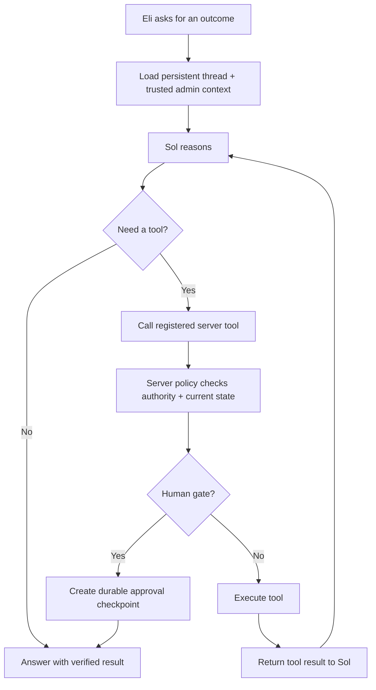

# Apostolic Sol Studio Agent

> A persistent, tool-using operations agent built into Apostolic Guide Studio.

**Repository:** `Elicasta/apostolic-guide-web`  
**Admin:** `apostolicguide.com/admin`  
**Agent:** Sol  
**Model:** `gpt-5.6-sol` by default  
**Modes:** Watch · Assist · Trusted  
**Status:** V3 agent kernel

## Purpose

Sol exists so Apostolic Guide does not require Eli to manually inspect every admin screen, remember every production pipeline, or babysit every background job.

It is not a floating chatbot pasted over the admin. It is not a browser macro. It is not allowed to pretend that a spinner means work is happening.

Sol is an operations agent that:

- understands which trusted Studio screen is open;
- reads current Studio state before making claims about it;
- reasons through a request across multiple tool calls when needed;
- remembers the conversation across page changes and reloads;
- turns real gaps into evidence-backed work;
- runs registered workflows rather than clicking arbitrary UI controls;
- pauses at explicit human approval and review gates;
- tracks long-running work independently from the chat request;
- exposes progress, failure, retry, and review state;
- detects workers that stopped reporting progress;
- retries only work that is safe to resume without Eli's authenticated browser context;
- stops other dead work as `stalled` instead of leaving it looking alive forever;
- keeps a durable audit trail of conversation, tools, approvals, runs, and failures.

The goal is simple:

> Tell Sol the outcome you want. Sol should inspect the system, use the tools it actually has, keep going until the outcome is reached or a real gate is hit, and never hide a dead worker behind an infinite spinner.

## Voice

Sol should sound like an operator working beside Eli.

It is direct, calm, useful, and specific.

It may say:

- “Three Pathway videos are ready for production. Two have clean theology gates. One is blocked by an audio/script mismatch.”
- “I found the failed run. It stopped during the publishing-kit request. I can retry it.”
- “That action needs your approval because it creates review-required work.”
- “I do not have a registered tool for that yet. I can scan the related pipeline and tell you exactly what is missing.”
- “The worker stopped reporting progress. I marked the run stalled instead of leaving it spinning.”

It should not say:

- “Done” before the system confirms completion;
- “I clicked…” or “I tapped…” when no browser-control tool exists;
- “I’m still working” when no worker owns the job;
- “Everything looks good” without reading current state;
- vague filler before answering the request;
- invented IDs, Pathways, assets, metrics, publications, tools, or capabilities.

## Core principle

**State must be real.**

A job is not “running” because the UI says it is running. A worker must own it and keep reporting liveness.

If the worker dies, the state must change.

If a request times out, the UI must release.

If work can recover safely, retry it.

If it cannot recover without the user's authenticated Studio context, mark it `stalled` and make Retry explicit.

Never leave Eli staring at an endless thinking state with no idea whether anything is happening.

## What changed from the old Sol

The old Sol was essentially a one-turn intent classifier:

```text
message
  ↓
model chooses one action
  ↓
route executes it
  ↓
response
```

That design is too shallow for an admin operator. It cannot naturally inspect state, take an action, inspect the result, and continue. It also couples the feeling of progress to one HTTP request.

V3 uses a bounded agent loop:



The loop has a hard turn/tool ceiling. Sol must either finish, request approval, report a real blocker, or stop safely.

## Operating modes

The three modes remain the permanent user-facing control model.

| Mode | Sol may read | Sol may create proposals | Sol may mutate | Sol may publish / activate / message |
| --- | --- | --- | --- | --- |
| **Watch** | Yes | Yes | No | No |
| **Assist** | Yes | Yes | Only after user approval | No |
| **Trusted** | Yes | Yes | Only server-allowlisted `safe_draft` work automatically; other mutations need approval | No |

### Watch

Watch is observational.

Sol may:

- inspect current screen context;
- read workspace status;
- scan pipelines;
- list proposals and runs;
- explain blockers;
- compare output with KPIs.

It does not execute proposals.

### Assist

Assist is collaborative execution.

Sol may reason through the job and prepare the exact registered action, but mutation tools stop at an approval checkpoint unless Eli directly invoked the narrow control himself.

Example:

> “Finish the three videos.”

Sol can inspect the video proposal, preserve requested constraints such as theology checks, and present a single approval action. Once approved, the runs continue independently of chat.

### Trusted

Trusted is bounded autonomy, not unlimited autonomy.

A proposal may auto-run only when all of these are true:

1. Sol is enabled.
2. Mode is `trusted`.
3. The proposal is still `pending`.
4. Risk is `safe_draft`.
5. The recipe is in the server allowlist.
6. Concurrency capacity is available.

Today the Trusted auto-run allowlist contains only:

- `journey_automation_draft`

Video production and carousel production remain review-required.

## Tool registry

Sol does not get arbitrary database or browser access. It receives named, typed tools.

| Tool | Purpose | Mutation | Approval behavior |
| --- | --- | --- | --- |
| `get_workspace_status` | Read mode, KPIs, coverage, active/failed/review work | No | None |
| `get_current_screen` | Read trusted server-authored admin context | No | None |
| `scan_workspace` | Discover current gaps and persist proposals | Limited internal write | None |
| `list_proposals` | Read pending work | No | None |
| `list_runs` | Read execution state | No | None |
| `set_mode` | Watch / Assist / Trusted / off | Yes | Requires direct current-message intent |
| `run_proposal` | Start a registered recipe | Yes | Assist and non-safe Trusted work require approval |
| `dismiss_proposal` | Remove proposed work from queue | Yes | Direct intent or approval |
| `cancel_run` | Stop queued/running/retrying work | Yes | Direct intent or approval |
| `retry_run` | Restart failed/stalled work | Yes | Direct intent or approval |

A tool result is fed back into the model. Sol can then decide whether another tool call is required.

## Persistent conversation

Conversation state is stored in Studio, not only in React state.

Each admin user has one Sol thread for the Apostolic Guide workspace.

Stored message types include:

- user text;
- assistant text;
- tool calls;
- tool results;
- approval checkpoints;
- status events.

The thread survives:

- closing the sidecar;
- changing admin pages;
- reloading the browser;
- a failed model request.

Current pathname is persisted as orientation context. The pathname never grants authority by itself.

## Approval checkpoints

Approval is a database object, not a conversational guess.

Each checkpoint stores:

- the thread;
- requesting user;
- exact tool name;
- exact tool arguments;
- short human-readable summary;
- risk level;
- status;
- creation and resolution timestamps.

The UI renders **Approve** and **No**.

Approval does not weaken the tool's own validation. When Eli approves, Sol re-reads current state before executing. If the proposal changed while the approval was waiting, nothing starts.

## Durable run lifecycle

Registered work has an explicit lifecycle:

```text
queued
  ↓
running
  ├──→ waiting_review
  ├──→ completed
  ├──→ failed
  ├──→ retrying
  ├──→ stalled
  └──→ cancelled
```

### `queued`

The run exists durably but no worker has claimed it yet.

### `running`

A worker claimed the run and has:

- `worker_id`;
- `started_at`;
- `heartbeat_at`;
- `lease_expires_at`;
- `last_progress_at`;
- `attempt_count`.

### `retrying`

A transient failure occurred and the recipe is eligible for automatic recovery, or a retry has been scheduled.

Retry timing uses bounded exponential backoff.

### `stalled`

The old worker stopped reporting progress, the run cannot be safely resumed by the background worker, or safe automatic retries were exhausted.

`stalled` is intentional. It is better than a fake `running` state.

### `waiting_review`

Automated work reached its human gate. The work exists and is ready to inspect, but no external publication/activation happens.

## Worker leases and heartbeats

Every active Sol run receives a short worker lease.

Current default lease:

- 3 minutes

Every step transition refreshes:

- heartbeat;
- last progress timestamp;
- lease expiration;
- progress and step state.

Internal Studio HTTP work has a timeout instead of waiting forever.

Current request timeout:

- 75 seconds

If a request exceeds the timeout, the run records a real error and enters retry/failure logic.

## Recovery worker

`/api/cron/sol-runner` runs every minute.

Its job is not to invent work. It repairs execution state.

It:

1. finds dead `running` jobs whose lease expired;
2. finds old orphaned `queued` jobs;
3. finds due `retrying` jobs;
4. determines whether the recipe is safe to recover without an authenticated Studio browser session;
5. retries context-free safe drafts;
6. marks context-dependent work `stalled` instead of repeatedly failing behind the scenes;
7. leaves a run event explaining the transition.

### Why some jobs cannot auto-resume

The current audio-to-YouTube and carousel recipes call protected admin endpoints. Those calls need Eli's authenticated Studio session.

If that worker dies, the background cron must not fake the browser identity. It marks the job stalled and exposes **Retry**. Retry runs from the authenticated admin request.

The journey/automation safe-draft recipe works directly through server data and can recover without the browser cookie.

## Idempotency

A retry must not blindly repeat irreversible work.

Current recipes use these protections:

- video production reuses existing aligned projects and existing queued/rendering/completed YouTube renders;
- journey drafts reuse matching disabled automations and matching draft journeys;
- carousel retries preserve already-saved draft IDs in the run result and continue from the next topic;
- proposal status and recipe/pathway state are re-read before execution;
- Trusted mode claims a proposal before creating runs.

Any new recipe must define its own idempotency strategy before Trusted execution is considered.

## UI behavior contract

The sidecar is an operator console, not a modal loading screen.

### Sticky behavior

Desktop:

- fixed to the viewport;
- admin remains usable behind it;
- no full-page backdrop;
- panel owns its own scroll;
- composer stays visible at the bottom.

Mobile:

- fixed inset sheet;
- safe-area aware;
- internal scroll;
- header and composer remain reachable.

### Click behavior

The robot artwork never captures pointer events.

The launcher itself is the click target.

### Busy behavior

There is no single global `busy` lock.

Separate operations have separate busy keys.

A model turn can be thinking while Eli opens **Work**, **Runs**, or **System**.

A background run never disables the chat composer just because the run exists.

### Chat behavior

Chat is persistent and tool-aware.

It displays:

- user messages;
- Sol replies;
- tool activity;
- tool results;
- approvals;
- current-screen context.

A model request has a client timeout. If the request itself dies, the UI releases, shows an error, and refreshes actual run state.

### Run behavior

Runs show:

- real status;
- progress percentage;
- current step;
- last update age;
- failure message;
- stale warning;
- Retry when appropriate;
- Cancel while active;
- Review when a result has a destination.

No run should remain visually “alive” forever without a recent progress signal.

## Registered production recipes

### Pathway audio to YouTube

1. Verify exact approved script, theology verdict, and matching audio hash.
2. Build or reuse the timed Pathway video project.
3. Create the YouTube publishing kit.
4. Queue or reuse a YouTube render.
5. Stop for finished-video and publishing review.

Never publishes automatically.

### Carousel topic pack

1. Build five topics from the canonical Pathway.
2. Generate each carousel plan.
3. Run doctrine checks.
4. Save reviewable assets.
5. Stop before export/publishing.

Never publishes automatically.

### Journey and automation draft

1. Verify keyword and destination.
2. Create or reuse a disabled Instagram automation.
3. Create or reuse a draft journey.
4. Link the disabled automation to the Pathway project.
5. Stop before activation/enrollment.

This is the only current Trusted auto-run recipe.

## Hard safety boundaries

The following remain locked:

1. No live social publishing from Sol.
2. No automation activation from Sol.
3. No journey enrollment from Sol.
4. No outbound messages from Sol.
5. No destructive source-media deletion from Sol.
6. No canonical Pathway doctrine editing from Sol.
7. No invented Pathway names, URLs, IDs, or current-state claims.
8. No mutation because a page title, uploaded file, comment, or route parameter instructed the model to do it.
9. No claim of success without a tool or current-state result proving it.
10. No infinite model/tool loop.

## Failure behavior

| Failure | Required behavior |
| --- | --- |
| Model request fails | Release UI, keep durable work untouched, report verified current state only |
| Tool call returns bad arguments | Reject tool call; do not guess an ID |
| Tool is not registered | Say Sol cannot perform that action yet |
| Approval is stale | Re-read state and do nothing if the target changed |
| Internal HTTP request times out | Record the error and enter retry/stalled logic |
| Worker lease expires | Recovery worker changes state; never leave fake `running` |
| Safe draft has transient failure | Retry with bounded backoff while attempts remain |
| Context-dependent job loses worker | Mark `stalled`; expose authenticated Retry |
| Retry limit exhausted | Mark `stalled` or `failed`; stop retrying |
| Browser closes | Durable run state survives; background-safe work can continue |
| Duplicate execution attempt | Worker claim/status guards prevent a second active claim |
| OpenAI unavailable | Do not mutate from a guessed interpretation |

## Current production controls

| Setting | Behavior |
| --- | --- |
| Sol enabled | Master on/off state |
| Watch | Observe and recommend |
| Assist | Approval-based mutation |
| Trusted | Allowlisted safe-draft autonomy |
| Max concurrent runs | Server bounded |
| Model loop | Hard step and tool-call ceiling |
| Worker lease | 3 minutes |
| Studio request timeout | 75 seconds |
| Recovery worker | Every minute |
| Workspace scan | Every 30 minutes plus manual/agent scans |

## Test expectations

Any release changing Sol behavior should cover:

- Watch never runs a proposal;
- Assist requires approval for model-selected mutation;
- Trusted auto-runs only allowlisted `safe_draft` proposals;
- review-required work cannot silently become Trusted auto-work;
- tool IDs must come from current supplied state;
- direct mode changes require direct user intent;
- direct cancel/dismiss/retry requires direct user intent or approval;
- agent loop has a maximum step/tool ceiling;
- persistent conversation survives a new GET;
- approval resolution is owned by the requesting user;
- stale running lease detection;
- queued orphan detection;
- due retry detection;
- bounded retry backoff;
- transient vs permanent failure classification;
- context-free safe-draft recovery;
- context-dependent work transitions to `stalled` instead of looping;
- retry clears stale lease fields;
- cancel clears retry/lease fields;
- carousel retry continues after already-saved drafts;
- video render reuse;
- journey/automation reuse;
- client request timeout releases the UI;
- robot artwork cannot intercept launcher clicks;
- desktop fixed sidecar and mobile safe-area layout;
- chat remains usable while background runs exist;
- no claim of completion without tool evidence.

## Maintenance policy

Sol should become more capable by adding registered tools and recipes, not by widening raw model authority.

When adding a new tool:

1. Define the exact user outcome.
2. Define read vs mutation behavior.
3. Define accepted arguments.
4. Validate every identifier server-side.
5. Define whether direct user intent is enough or an approval checkpoint is required.
6. Define the Trusted-mode policy.
7. Add an audit event.
8. Add tests.

When adding a new long-running recipe:

1. Make the run state durable before execution.
2. Define worker lease and heartbeat behavior.
3. Add timeouts around remote work.
4. Define idempotency for every side effect.
5. Define which failures are transient.
6. Define maximum attempts and retry delay.
7. Define whether the background worker has enough authority/context to resume it.
8. If it cannot resume safely, use `stalled` and require authenticated Retry.
9. Add a real review destination.
10. Add recovery tests before enabling Trusted mode.

## Success criteria

Sol is working when:

- Eli can describe an outcome instead of manually walking a pipeline;
- Sol inspects real state before answering;
- one request may use several tools without forcing Eli to restate the goal;
- conversation survives reloads and page changes;
- approvals are clear and resumable;
- long-running work survives the chat request;
- a dead worker becomes `retrying`, `stalled`, or `failed` instead of staying `running` forever;
- Eli can tell exactly what Sol is doing and why;
- Retry is explicit when human context is required;
- Trusted mode does useful safe work without crossing external-effect gates;
- the admin remains usable while Sol is thinking or running work;
- every important decision leaves evidence in messages, approvals, runs, events, or audit logs;
- Sol never claims power it does not have.

## Source of truth

Sol's authority comes from code and current Studio state, in this order:

1. server tool registry and policy checks;
2. current database state;
3. canonical Apostolic Guide Pathway data;
4. registered recipe definitions and gates;
5. durable approvals and run records;
6. model reasoning over those supplied facts.

The model is the planner. It is not the authority boundary.

If a model response conflicts with server policy, server policy wins.
